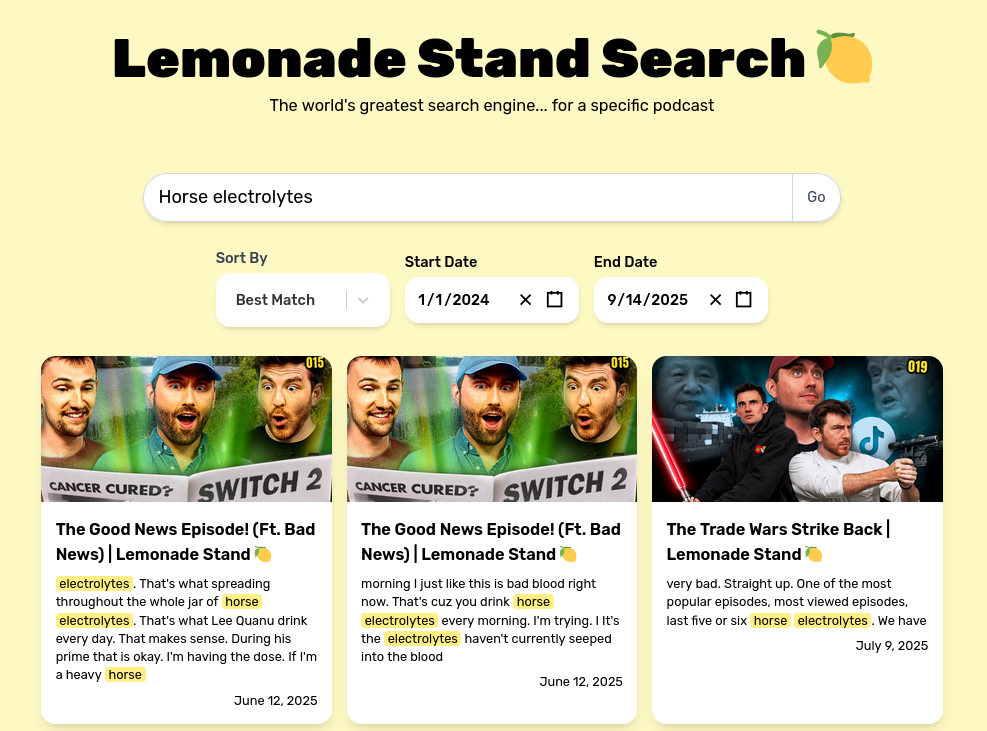

# Lemonade Stand Search

### Find any clip that you remember



Website link: [CLICK HERE](https://lemonadestandsearch.connorlangan.ca)

Lemonade Stand Search is a simple Full-Stack web application that can find
clips you remember from the [Lemonade Stand Podcast](https://www.youtube.com/@LemonadeStandPodcast).

# Tech Stack

## Frontend

- Vite + React.js
- Typescript
- TailwindCSS

## Backend

- Flask
- Python
- PostgreSQL
- Nginx

# Development

## General

- Create a Google API Key
- Create a PostgreSQL database and store info in .env
- Note to self: make .env.examples

```bash
systemctl start postgresql
```

## Backend

`cd` into backend and run:

```bash
python -m venv venv
source venv/bin/activate
python -m pip install -r requirements.txt
```

Initialise the tables:

```bash
cd scripts
python initialise_tables.py
```

You will also need to populate the database with all initial data, which
there is no script for this yet...

But you may begin by retrieving the latest video:

```bash
python process_new_video.py
```

And then run the backend server:

```bash
cd ../api
flask run --host=0.0.0.0
```

## Frontend

`cd` into frontend and run: 

```bash
npm install
npm run dev
```

# TODO:

- [ ] Set up cron script!
- [ ] Purchase a proper domain
- [ ] Reddit Post to advertise
- [ ] Add dark mode and theme toggle
- [ ] Add link to GitHub
- [ ] Add "Buy me a coffee"
